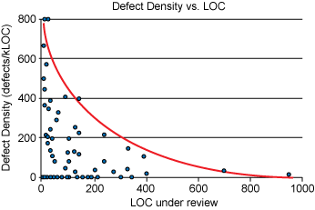

# Code Reviews

## 400 Lines of Code at a Time   
A SmartBear study of a Cisco Systems programming team revealed that developers should review no more than 200 to 400 lines of code (LOC) at a time.

**_Guidelines_**

- From the graph, we can see that in practice, a review of 200-400 LOC over 60 to 90 minutes should yield 70-90% defect discovery. If 10 defects existed in the code, a properly conducted review would find between seven and nine of them. This is a very good ratio.
- From the graph, we can also see that the brain can only process so much information so it is important to <strong><em>not go above</em></strong> the 400 LOC range.

## Approving vs Requesting Changes   
A good way of organizing code reviews would be that once a reviewer completes their review, they can either mark it approved, block the review with change requests, or not set a specific status, leaving it in a “not yet approved” state. How reviewers use the approve and request changes statuses is telling of the code reviews.

**_Bad Practices_**

- approving changes while there are open-ended questions.
- Not being explicit when requesting a follow-up.

**_Good Practices_**

- Being firm on the principle but flexible on the practice.
- For changes that are more urgent than others, reviewers try to make themselves available for quicker review

## Avoid Sarcasm and Emotions   
Using emojis or not addressing specific issues is extremeley counter productive. keeping emotions out of code review on both sides is essential. As a rule of thumb, it’s usually better to give recommendations with reasoning than it is to just point blank tell others what they should have done in the first place.

***Guidelines***  
- Give constructive feedbacks, rather than critical ones.
- Avoid comments that do not add any value or that are purely opinion-based.
- Provide some links to illustrate your comments.

**_Example_** 
Bad: 
"Did you even test this code before sending it?" 😡

Good: 
"The code breaks when X. Could you please address this?"

## Let Tools Take on Some of the Burden   
Tools are especially good at checking code style and convention. They can also detect simple bugs and security issues. If you hand off the simple and straightforward tasks to automation tools, you can focus on deeper, more challenging issues.

**_Example_** 
Recently, a tool that is used in the industry is [SonarQube](https://www.sonarqube.org/), one of the most popular analyzer tools. You will not be able to find every issue or provide every kind of creative feedback a skilled reviewer can. Generally speaking, it does less than 5 percent of what’s needed, but it still really helps the reviewer by automating some parts of the process.

## Build and Test  
 Prior to opening the Pull Request, it is important to ensure that the task being worked on works as expected and has not lead to any regression.

***Guidelines***
- Generate package using recommended way.
- Run all unit tests and integration tests - must be all passing prior pull request.

## Include everyone  
It is important to include everyone in the code review process. It helps every member being comfortable with the process itself. For junior developers, it is an excellent opportunity to learn.

**_References_**

- https://smartbear.com/learn/code-review/best-practices-for-peer-code-review/
- https://stackoverflow.blog/2019/09/30/how-to-make-good-code-reviews-better/
- https://codingsans.com/blog/code-review
- https://www.infoq.com/articles/practices-better-code-reviews/
- https://www.perforce.com/blog/qac/9-best-practices-for-code-review
